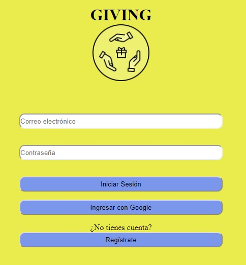
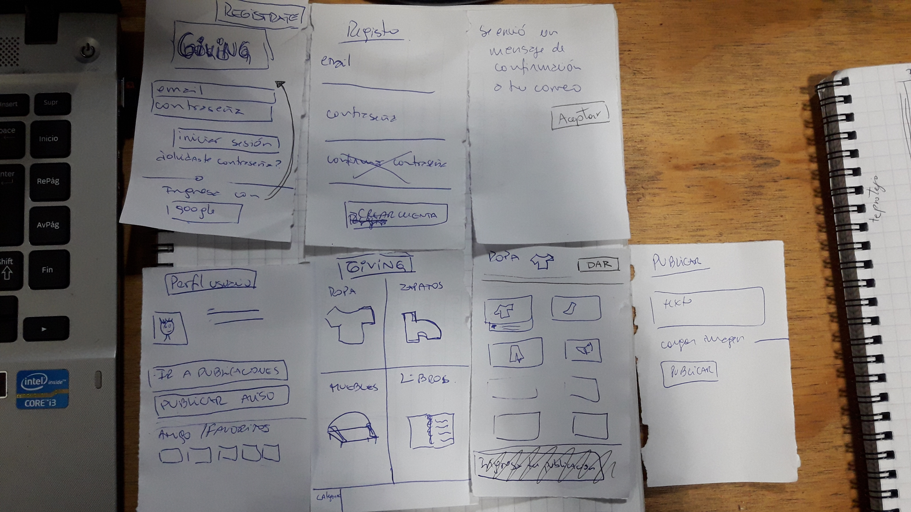
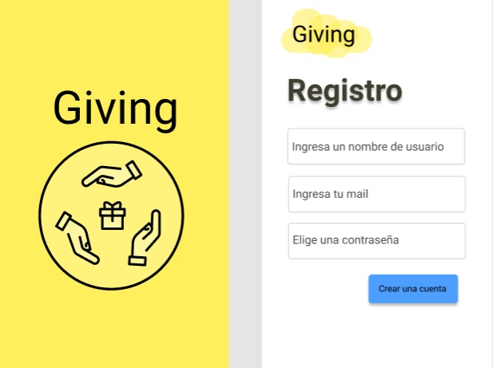
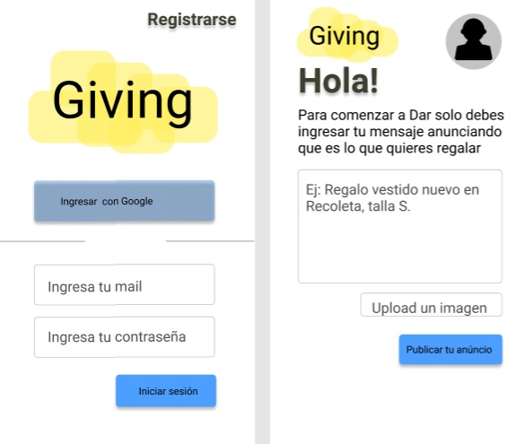
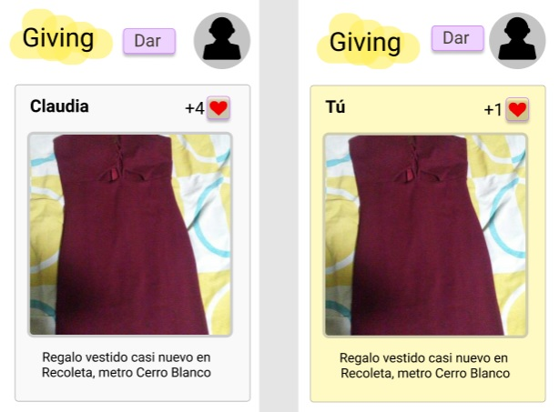
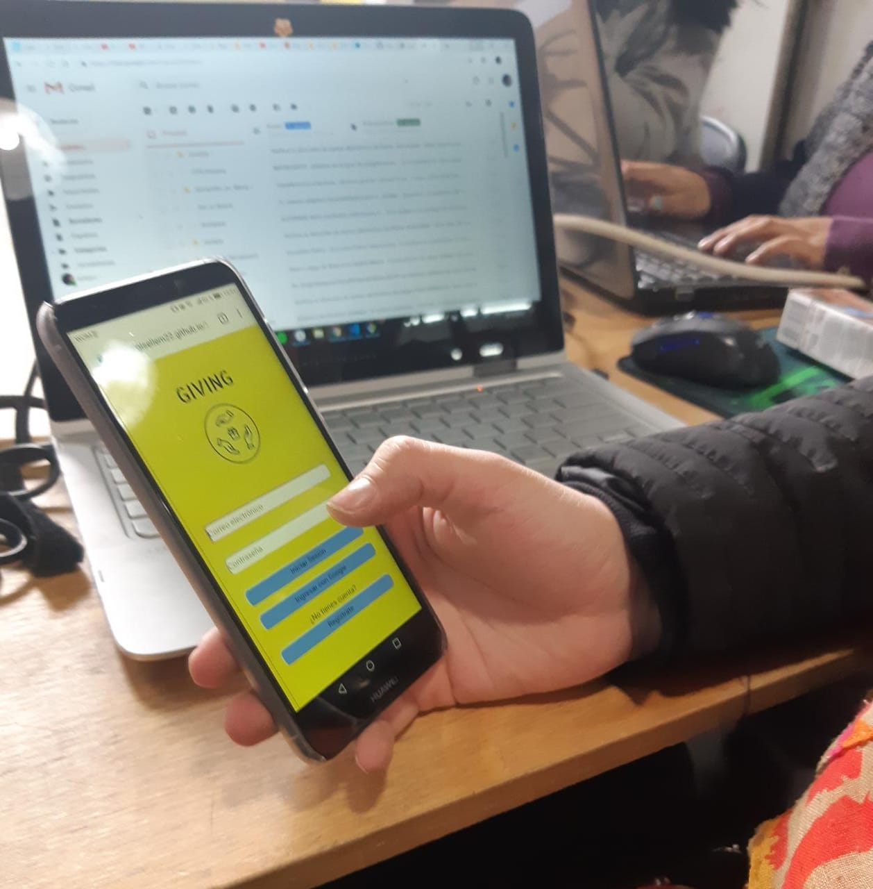

# GIVING Red Social

GIVING es una red social que se creó pensando en aquellas personas que tienen objetos, como ropa, muebles, libros, etc. que ya no usan y se encuentran en buen estado y quieran regalarlos a quien lo necesite. Igualmente será usada por quienes busquen ahorrar dinero y además valoran la reutilización de objetos con la finalidad de disminuir el impacto ambiental, provocado por desechar estos productos que aún no cumplieron su vida útil. 

Esta idea nació a través de investigaciones en grupos de facebook dedicados al intercambio de objetos usados, con o sin fines lucrativos, y se determinó la necesidad de crear una plataforma que permita donar y recibir objetos que ya no se usan, sin embargo, nuestra propuesta no tiene por objetivo el enfoque a una transacción comercial, pero sí crear un espacio de donación o intercambio y reciclaje.

## PLANIFICACIÓN

Nuestra planificación se encuentrada detallada en el siguiente link de [Trello](https://trello.com/b/szZa6Bxq/social-network), la cual se basa en las Historias de Usuarios.

## HISTORIAS DE USUARIOS

1) COMO alguien que quiere donar un pantalón QUIERO registrarme en la página PARA poder ingresar a la comunidad y darlo a quien lo necesite

Criterios de Aceptación:

*	Permitir al usuario el ingreso de un correo electrónico
*	Mostrar mensaje de error si no ingresa un correo electrónico
*	Permitir al usuario el ingreso de la contraseña
*	Mostrar mensaje de error si la contraseña no se cumple con el mínimo de 6 caracteres
*	Se permite hacer click en botón "Crear una cuenta" para validar los datos del registro.
*	Mostrar mensaje donde se informa que ha sido enviado un correo a su cuenta confirmando el registro

2) COMO alguien que quiere donar cosas QUIERO ingresar en la página, a través mi cuenta de google PARA poder ingresar de manera más rápida a la comunidad.

Criterios de Aceptación:

*	Permitir hacer click al botón "Ingresa con Google"
*	Se mostrará mensaje de verificación de los permisos por parte de Google.

## CONSIDERACIONES TÉCNICAS

* La lógica del proyecto fue implementada usando JS, HTML y CSS.
* La app cuenta con multiples vistas (Single Page Application (SPA)), gestionadas por un archivo (router.js) que permite su visualización, dependiendo de las elecciones del usuario.
* Sitio responsive, (mobile first), usando flexbox y media queries para celulares y tablets
* Se usó [Firebase](https://firebase.google.com/) como plataforma de desarrollo.
* Se recibió _code review_ de al menos una compañera de otro equipo.
* Se realizaron _test_ unitarios y, además, testeos del producto manualmente.
* Se realizaron  _pruebas_ de usabilidad y el _feedback_ del usuario fue incorporado.
* Existen etiquetas git tag, de la versión.
* Deploy del proyecto.

## PROTOTIPADO

Una vez identificado el problema y el tipo de usuario, se procedió a diseñar la plataforma en distintos formatos.

Prototipo de baja fidelidad:

Prototipo de alta fidelidad (Figma):

Inicio y Registro de Usuario:

Home y Escribir publicación:

Muro:

## TESTEOS DE USUARIOS

Se realizaron testeos de usabilidad, mostrando el [Deploy](https://gisellem22.github.io/SCL009-Social-Network/index.html)  

### FUTURAS MEJORAS

* Implementar inicio de sesión a través del registro con correo electrónico.
* Implementar la funcionalidad del muro.

### DESARROLLADORAS

Claudia Araya

Giselle Machado